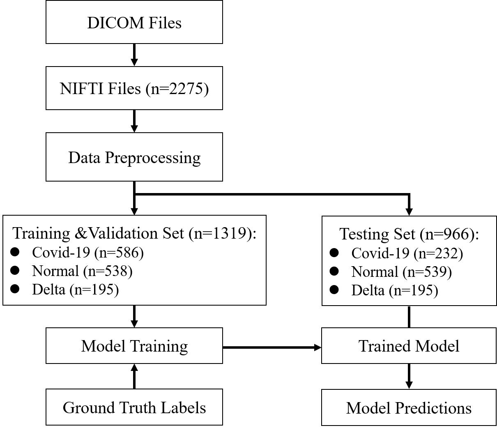
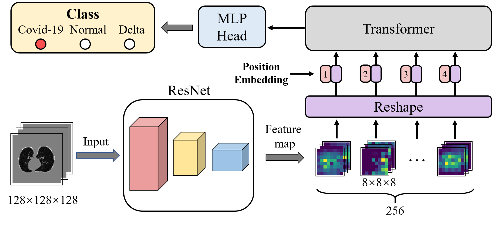

# use 3D-CNN to identify delta variant of covid-19 based on Chest CT

## Pipeline

## Data preprocessing 
* Convert CT image from the DICOM format to the NIfTI format. 
* Images are reoriented to the same direction and resampled to the fixed size (128×128×128). 
* Use K-means algorithm to extract lung region from CT images. 
* The intensity values are clipped to the range [-1000, 300] and a z-score normalization is applied based on the mean and standard deviation of the intensity values. 
## Method
